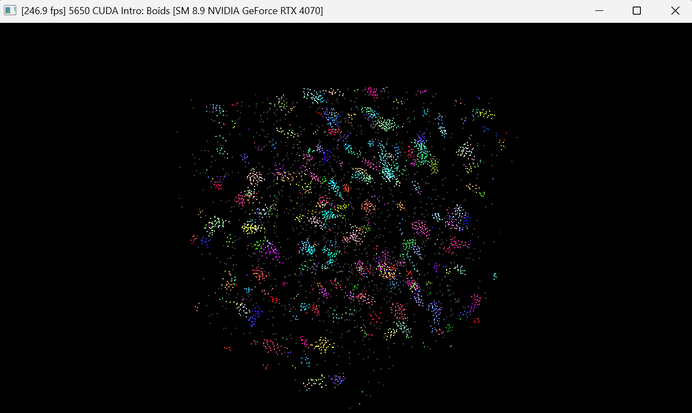
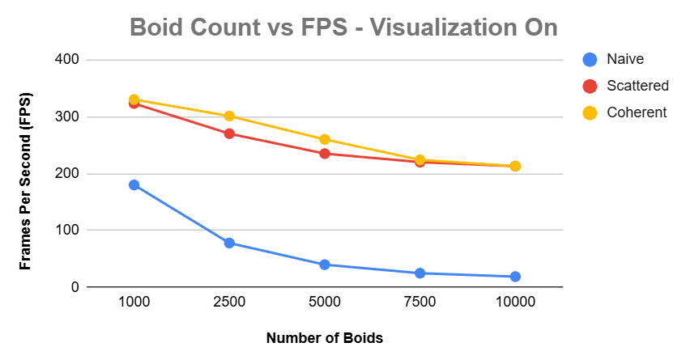
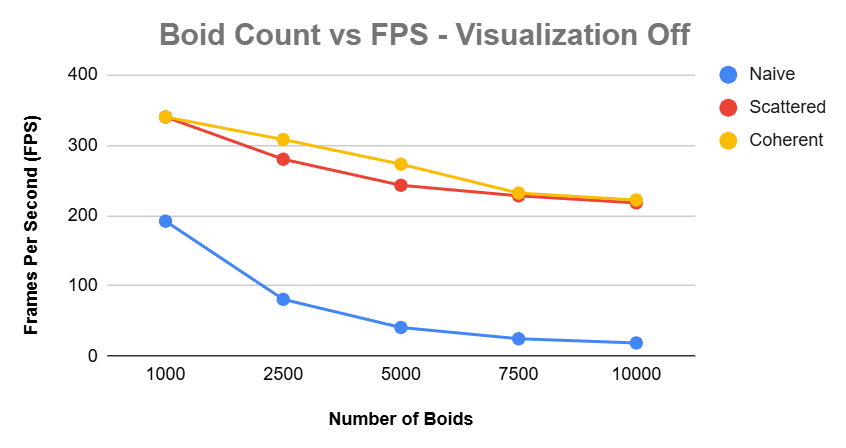
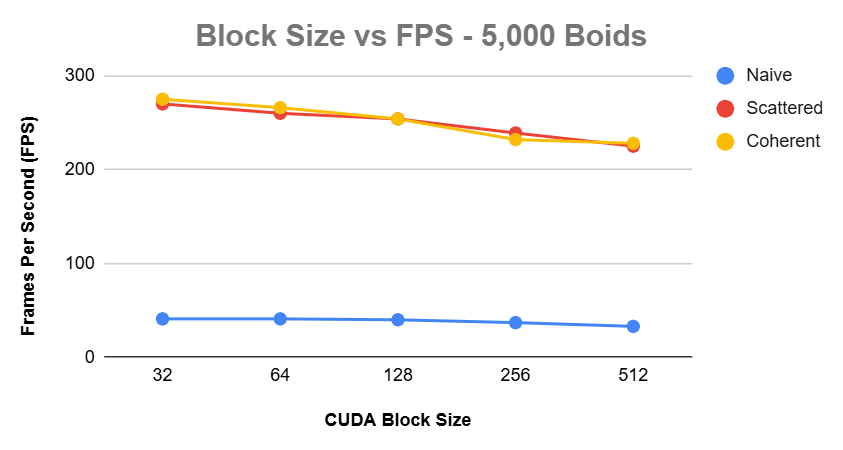
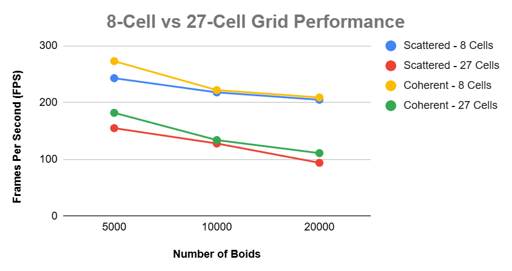

**University of Pennsylvania, CIS 5650: GPU Programming and Architecture,
Project 1 - Flocking**

* Daniel Price
  * [LinkedIn](https://www.linkedin.com/in/daniel-d-price/)
* Tested on: Windows 11, AMD Ryzen 9 7950X @ 4.50GHz 64GB, NVIDIA GeForce RTX 4070 12.0GB

---
### Graphs
FPS measurement is taken from the average of 10s of the Window Title after frame rate has stabilized. 

---
### Questions
***For each implementation, how does changing the number of boids affect
performance? Why do you think this is?***
- Increasing the number of boids reduces the performance for all of the implementations. This is expected behavior as the more boids thre are the more calculations are ncecessary. The naive version declined t he fasted because of the O(n^2) complexity of the algorithm. The grid implementations were able to maintain a higher frame rate because they reduce the number of calculations necessary by only checking nearby boids.

***For each implementation, how does changing the block count and block size
affect performance? Why do you think this is?***
- Changing the block size has multiple effects on performance. For example, it changes the occupancy, and scheduling overhead. 32 cells per block was the best performing block size for my implementation. 

***For the coherent uniform grid: did you experience any performance improvements
with the more coherent uniform grid? Was this the outcome you expected?
Why or why not?***
- The coherent uniform grid did improve the performance but by less than I expected, often being close to negligable in performance increase. The increased performance as a result of better memory locality was offset by the cost of rearranging the posistions and velocities at each timestamp.

***Did changing cell width and checking 27 vs 8 neighboring cells affect performance?
Why or why not? Be careful: it is insufficient (and possibly incorrect) to say
that 27-cell is slower simply because there are more cells to check!***
- The 27 cell implementation examines more cells but fewer boids per cell in comparison to the 8 cell implementation. In the end, the 8 cells performed better as a result of the reduced cell overhead outweighing the fewer candidate comparisons. 